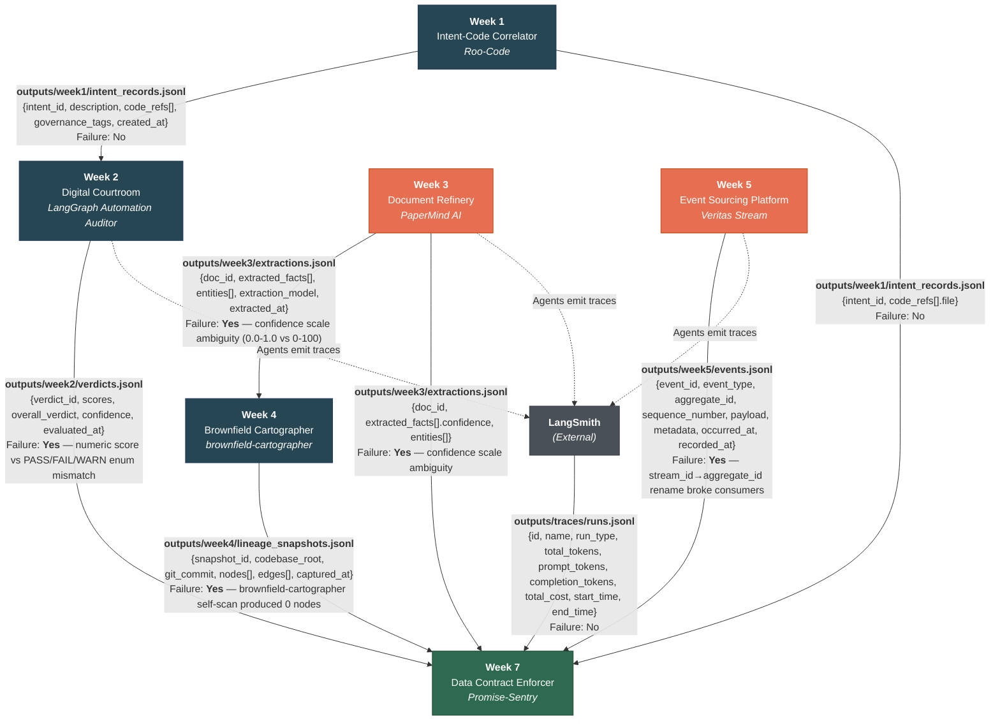

# Inter-System Data Flow Diagram

## Summary of Interfaces

| # | From | To | Data Path | Failure History |
|---|------|----|-----------|-----------------|
| 1 | Week 1 Intent Correlator | Week 2 Digital Courtroom | `outputs/week1/intent_records.jsonl` | No |
| 2 | Week 3 Document Refinery | Week 4 Brownfield Cartographer | `outputs/week3/extractions.jsonl` | **Yes** — confidence scale 0.0-1.0 vs 0-100 ambiguity |
| 3 | Week 4 Brownfield Cartographer | Week 7 Data Contract Enforcer | `outputs/week4/lineage_snapshots.jsonl` | **Yes** — self-scan produced 0 nodes |
| 4 | Week 5 Event Sourcing Platform | Week 7 Data Contract Enforcer | `outputs/week5/events.jsonl` | **Yes** — `stream_id` → `aggregate_id` rename |
| 5 | Week 1 Intent Correlator | Week 7 Data Contract Enforcer | `outputs/week1/intent_records.jsonl` | No |
| 6 | Week 2 Digital Courtroom | Week 7 Data Contract Enforcer | `outputs/week2/verdicts.jsonl` | **Yes** — numeric score vs enum mismatch |
| 7 | Week 3 Document Refinery | Week 7 Data Contract Enforcer | `outputs/week3/extractions.jsonl` | **Yes** — confidence scale ambiguity |
| 8 | LangSmith | Week 7 Data Contract Enforcer | `outputs/traces/runs.jsonl` | No |
| 9 | Weeks 2,3,5 agents | LangSmith | (trace telemetry) | No |

**Red-highlighted systems** (Week 3, Week 5) have caused the most interface failures and are prioritized for contract enforcement.
