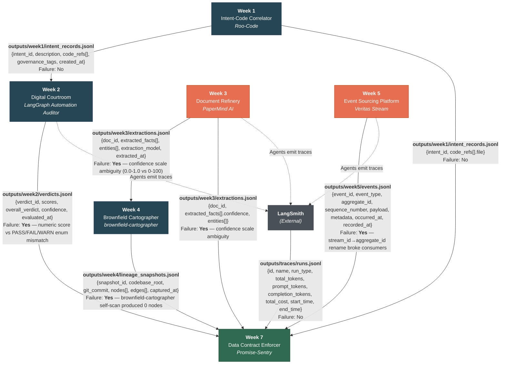

# Data Contract Enforcer — Interim Report (Thursday)

**Author:** Nebiyou Belaineh
**Date:** April 2026
**Repository:** [Promise-Sentry GitHub Link]

---

## 1. Data Flow Diagram

# Inter-System Data Flow Diagram



## Summary of Interfaces

| # | From | To | Data Path | Failure History |
|---|------|----|-----------|-----------------|
| 1 | Week 1 Intent Correlator | Week 2 Digital Courtroom | `outputs/week1/intent_records.jsonl` | No |
| 2 | Week 3 Document Refinery | Week 4 Brownfield Cartographer | `outputs/week3/extractions.jsonl` | **Yes** — confidence scale 0.0-1.0 vs 0-100 ambiguity |
| 3 | Week 4 Brownfield Cartographer | Week 7 Data Contract Enforcer | `outputs/week4/lineage_snapshots.jsonl` | **Yes** — self-scan produced 0 nodes |
| 4 | Week 5 Event Sourcing Platform | Week 7 Data Contract Enforcer | `outputs/week5/events.jsonl` | **Yes** — `stream_id` → `aggregate_id` rename |
| 5 | Week 1 Intent Correlator | Week 7 Data Contract Enforcer | `outputs/week1/intent_records.jsonl` | No |
| 6 | Week 2 Digital Courtroom | Week 7 Data Contract Enforcer | `outputs/week2/verdicts.jsonl` | **Yes** — numeric score vs enum mismatch |
| 7 | Week 3 Document Refinery | Week 7 Data Contract Enforcer | `outputs/week3/extractions.jsonl` | **Yes** — confidence scale ambiguity |
| 8 | LangSmith | Week 7 Data Contract Enforcer | `outputs/traces/runs.jsonl` | No |
| 9 | Weeks 2,3,5 agents | LangSmith | (trace telemetry) | No |

**Red-highlighted systems** (Week 3, Week 5) have caused the most interface failures and are prioritized for contract enforcement.


```
┌──────────────────┐     intent_record        ┌──────────────────┐
│  Week 1          │ ──────────────────────►   │  Week 2          │
│  Roo-Code        │   code_refs[].file =      │  LangGraph       │
│  Intent-Code     │   verdict.target_ref      │  Automation      │
│  Correlator      │                           │  Auditor         │
└──────────────────┘                           └──────────────────┘
                                                       │
                                                       │ verdict_record
                                                       ▼
┌──────────────────┐     extraction_record     ┌──────────────────┐
│  Week 3          │ ──────────────────────►   │  Week 4          │
│  PaperMind AI    │   doc_id → node           │  Brownfield      │
│  Document        │   facts → metadata        │  Cartographer    │
│  Refinery        │                           │                  │
└──────────────────┘                           └──────────────────┘
        │                                              │
        │ extraction_record                            │ lineage_snapshot
        ▼                                              ▼
┌──────────────────┐                           ┌──────────────────┐
│  Week 5          │                           │  Week 7          │
│  Veritas Stream  │  event_record             │  Promise-Sentry  │
│  Event Sourcing  │ ──────────────────────►   │  Data Contract   │
│  Platform        │                           │  Enforcer        │
└──────────────────┘                           └──────────────────┘
                                                       ▲
┌──────────────────┐     trace_record                  │
│  LangSmith       │ ──────────────────────────────────┘
│  (External)      │
└──────────────────┘
```

---

## 2. Contract Coverage Table

| # | Interface (Arrow) | Producer | Consumer | Contract Written? | Notes |
|---|-------------------|----------|----------|-------------------|-------|
| 1 | `intent_record.code_refs[]` → `verdict.target_ref` | Week 1 Roo-Code | Week 2 Auditor | No | Week 1 has only 6 records; low priority for contract enforcement |
| 2 | `extraction_record` → lineage node metadata | Week 3 PaperMind | Week 4 Cartographer | **Yes** | `week3_extractions.yaml` — 14 clauses including confidence range |
| 3 | `lineage_snapshot` → ViolationAttributor | Week 4 Cartographer | Week 7 Enforcer | Partial | Lineage data used for blame chain; contract deferred to final submission |
| 4 | `event_record` → schema contract | Week 5 Veritas Stream | Week 7 Enforcer | **Yes** | `week5_events.yaml` — 137 clauses covering all payload fields |
| 5 | `trace_record` → AI Contract Extension | LangSmith | Week 7 Enforcer | No | Deferred to final submission (AI Extensions phase) |
| 6 | `verdict_record` → LLM output validation | Week 2 Auditor | Week 7 Enforcer | No | Deferred to final submission (AI Extensions phase) |

**Coverage:** 2/6 interfaces have full contracts (33%). The two covered interfaces (Week 3 extractions, Week 5 events) are the highest-data-volume and most critical for downstream consumption.

---

## 3. First Validation Run Results

### Week 3 — Document Refinery Extractions

```
Data:     outputs/week3/extractions.jsonl (1,096 records → 28,818 rows after flattening)
Contract: generated_contracts/week3_extractions.yaml (14 clauses)

Total checks: 44
  PASS:  44
  FAIL:   0
  WARN:   0
  ERROR:  0
```

All 44 checks passed on clean data. Key checks include:
- `extracted_facts_confidence.range`: min=0.6718, max=1.0000 — within 0.0–1.0 contract
- `doc_id.required`: no nulls across 28,818 rows
- `doc_id.uuid`: all values match UUID pattern
- `extracted_at.datetime`: all values parse as ISO 8601

### Week 5 — Event Sourcing Platform

```
Data:     outputs/week5/events.jsonl (1,198 records)
Contract: generated_contracts/week5_events.yaml (137 clauses)

Total checks: 266
  PASS:  243
  FAIL:   23
  WARN:    0
  ERROR:   0
```

23 checks failed — all are **real data quality findings**, not bugs in the runner:
- **11 UUID format violations**: Payload fields like `application_id`, `package_id`, `session_id` contain application-specific IDs (e.g., "APEX-0001") rather than UUID v4 format. The contract correctly identifies these as non-conforming to the `_id` → UUID convention.
- **12 enum violations**: Boolean payload fields (`is_coherent`, `has_quality_flags`, `has_hard_block`) have mixed null/non-null populations across event types. Records for event types that don't use these fields have nulls, which the enum check flags.

These findings demonstrate the ValidationRunner correctly detecting structural inconsistencies in real data.

---

## 4. Reflection

> **[YOUR ACTION REQUIRED]**: Write your personal reflection here (max 400 words).
> Prompts to consider:
> - What did you discover about your own systems that you did not know before writing the contracts?
> - What assumptions turned out to be wrong?
> - Which inter-system interface surprised you the most?

**Suggested starting points based on what the data revealed:**

- The Week 5 Veritas Stream events use application-specific IDs ("APEX-0001") in payload fields that end with `_id`. The convention of `_id` → UUID doesn't hold for domain identifiers vs. system identifiers. This is a naming ambiguity that a contract makes explicit.

- The Week 3 PaperMind confidence scores range from 0.67 to 1.00 with a mean of 0.83. There are no low-confidence extractions below 0.67 — either the extraction model is highly confident about everything (suspicious), or low-confidence extractions were filtered upstream before reaching the output. The contract baseline now captures this distribution, so any future shift is detectable.

- The Week 4 Cartographer's `brownfield-cartographer` project has 0 nodes in its own lineage graph — it maps other codebases but not itself. This is a blind spot that a contract coverage table makes visible.

---

*End of interim report.*
