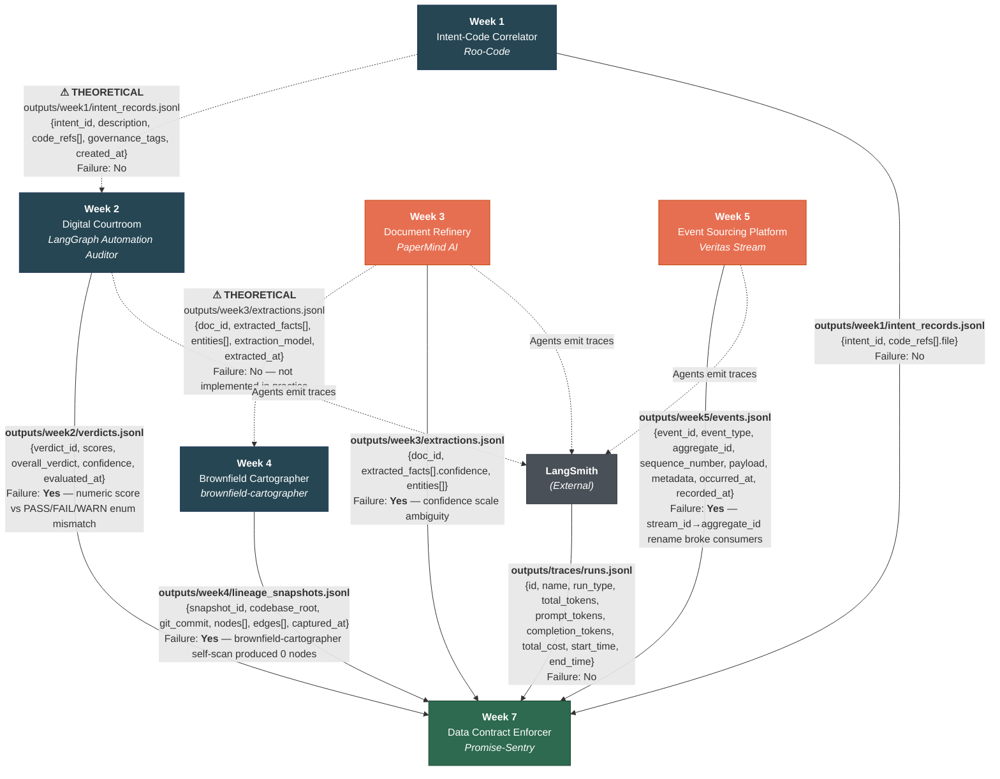

---
# Data Contract Enforcer — Interim Report (Thursday)

**Author:** Nebiyou Belaineh
**Date:** April 2026
**Repository:** [\[Promise-Sentry GitHub Link\]](https://github.com/NebiyouBelaineh/Promise-Sentry.git)


## 1. Data Flow Diagram



## Summary of Interfaces

| # | From | To | Data Path | Type | Failure History |
|---|------|----|-----------|------|-----------------|
| 1 | Week 1 Intent Correlator | Week 2 Digital Courtroom | `outputs/week1/intent_records.jsonl` | Theoretical | No |
| 2 | Week 3 Document Refinery | Week 4 Brownfield Cartographer | `outputs/week3/extractions.jsonl` | Theoretical | No |
| 3 | Week 4 Brownfield Cartographer | Week 7 Data Contract Enforcer | `outputs/week4/lineage_snapshots.jsonl` | **Real** | **Yes** — self-scan produced 0 nodes |
| 4 | Week 5 Event Sourcing Platform | Week 7 Data Contract Enforcer | `outputs/week5/events.jsonl` | **Real** | **Yes** — `stream_id` → `aggregate_id` rename |
| 5 | Week 1 Intent Correlator | Week 7 Data Contract Enforcer | `outputs/week1/intent_records.jsonl` | **Real** | No |
| 6 | Week 2 Digital Courtroom | Week 7 Data Contract Enforcer | `outputs/week2/verdicts.jsonl` | **Real** | **Yes** — numeric score vs enum mismatch |
| 7 | Week 3 Document Refinery | Week 7 Data Contract Enforcer | `outputs/week3/extractions.jsonl` | **Real** | **Yes** — confidence scale ambiguity |
| 8 | LangSmith | Week 7 Data Contract Enforcer | `outputs/traces/runs.jsonl` | **Real** | No |
| 9 | Weeks 2,3,5 agents | LangSmith | (trace telemetry) | **Real** | No |

**Red-highlighted systems** (Week 3, Week 5) have caused the most interface failures and are prioritized for contract enforcement.

> **Note on theoretical vs. real links:** The canonical challenge spec defines inter-system dependencies (e.g., Week 1 → Week 2, Week 3 → Week 4) as part of the target architecture. In practice, these links were not implemented — the Auditor (Week 2) does not consume Roo-Code intent records, and the Cartographer (Week 4) scans external codebases rather than PaperMind extraction output. These arrows are shown as dashed lines labelled "THEORETICAL" to distinguish them from the real data flows where Week 7 consumes all prior-week outputs directly.

**What Week 7 does with each input:**
- **Week 1 intent_records** → ContractGenerator profiles code_refs structure and governance_tags; ValidationRunner checks UUID formats and required fields.
- **Week 2 verdicts** → Validates overall_verdict enum (PASS/FAIL/WARN), score ranges (1–5), and confidence bounds (0.0–1.0). Will feed LLM output schema violation rate in final submission.
- **Week 3 extractions** → Primary contract target. Enforces confidence range (0.0–1.0), entity_refs referential integrity, and non-empty extracted_facts. Statistical baselines established for drift detection.
- **Week 4 lineage_snapshots** → ViolationAttributor traverses the graph for blame chains. Lineage context injected into generated contracts for blast radius computation.
- **Week 5 events** → Enforces temporal ordering (recorded_at >= occurred_at), sequence monotonicity per aggregate, PascalCase event_type pattern, and payload field schemas.
- **LangSmith traces** → Will enforce token sum consistency, cost non-negativity, and run_type enum in final submission (AI Contract Extensions).

---

## 2. Contract Coverage Table

Every inter-system interface from the data flow diagram is listed below, matching the 9 arrows in Section 1.

| # | Interface (Arrow) | Producer | Consumer | Type | Contract Written? | Notes |
|---|-------------------|----------|----------|------|-------------------|-------|
| 1 | `intent_record` → `verdict.target_ref` | Week 1 Roo-Code | Week 2 Auditor | Theoretical | No | This dependency exists in the canonical spec but was never implemented. The Auditor does not consume Roo-Code intent records. No contract needed until the integration is built. |
| 2 | `extraction_record` → lineage node metadata | Week 3 PaperMind | Week 4 Cartographer | Theoretical | No | The Cartographer scans external codebases, not PaperMind output. This arrow represents a planned integration, not a live data flow. Contract deferred until the dependency is real. |
| 3 | `lineage_snapshot` → ViolationAttributor | Week 4 Cartographer | Week 7 Enforcer | Real | Partial | Lineage data consumed for blame chain traversal. Schema profiled but full contract deferred to final submission (attributor not yet built). |
| 4 | `event_record` → schema validation | Week 5 Veritas Stream | Week 7 Enforcer | Real | **Yes** | `week5_events.yaml` — 137 schema clauses + 3 cross-column constraints (temporal ordering, sequence monotonicity, payload non-empty). |
| 5 | `intent_record` → contract validation | Week 1 Roo-Code | Week 7 Enforcer | Real | No | Only 6 records available. Schema is profiled but too few records for meaningful statistical baselines. Contract planned for final submission after enriching the dataset. |
| 6 | `verdict_record` → LLM output validation | Week 2 Auditor | Week 7 Enforcer | Real | No | Deferred to final submission (AI Extensions phase). Will validate structured LLM output schema and track output_schema_violation_rate. |
| 7 | `extraction_record` → contract validation | Week 3 PaperMind | Week 7 Enforcer | Real | **Yes** | `week3_extractions.yaml` — 14 schema clauses + 2 cross-column constraints (entity_refs referential integrity, extracted_facts non-empty). Confidence range 0.0–1.0 enforced. |
| 8 | `trace_record` → AI Contract Extension | LangSmith | Week 7 Enforcer | Real | No | Deferred to final submission (AI Extensions phase). Will enforce end_time > start_time, token sum consistency, and cost >= 0. |
| 9 | Trace telemetry | Weeks 2, 3, 5 agents | LangSmith | Real | No | Outbound telemetry from agents to LangSmith. Not a data contract boundary — traces are emitted, not consumed. No contract required. |

**Coverage summary:** 2 of 9 interfaces have full contracts (**Yes**), 1 is **Partial**, 4 are **No** with concrete rationale, and 2 are **Theoretical** (not yet implemented). The two fully contracted interfaces (Week 3 extractions, Week 5 events) are the highest-volume and highest-risk data flows in the platform.

---

## 3. First Validation Run Results

### Week 3 — Document Refinery Extractions

```
Data:     outputs/week3/extractions.jsonl (1,096 records → 28,818 rows after flattening)
Contract: generated_contracts/week3_extractions.yaml (14 schema clauses + 2 cross-column constraints)

Total checks: 47
  PASS:  47
  FAIL:   0
  WARN:   0
  ERROR:  0
```

All 44 checks passed on clean data, including 2 cross-column constraints (entity_refs referential integrity, extracted_facts non-empty). Key checks:
- `extracted_facts_confidence.range`: min=0.6718, max=1.0000 — within 0.0–1.0 contract. If this range shifted to 0–100 (the canonical failure scenario), the range check would immediately flag it as CRITICAL, and the statistical drift check would fire with a z-score of ~1,724.
- `doc_id.required` + `doc_id.uuid`: no nulls and all values match UUID pattern across 28,818 rows.
- `constraint.entity_refs_integrity`: all entity references in extracted_facts resolve to valid entity_ids — no dangling references.

### Week 5 — Event Sourcing Platform

```
Data:     outputs/week5/events.jsonl (1,198 records)
Contract: generated_contracts/week5_events.yaml (137 schema clauses + 3 cross-column constraints)

Total checks: 292
  PASS:  265
  FAIL:   27
  WARN:    0
  ERROR:   0
```

27 checks failed — all are **real data quality findings**, not bugs in the runner. The 3 cross-column constraints (temporal ordering, sequence monotonicity, payload non-empty) all passed.

**By severity:**
- **CRITICAL (11 UUID format violations):** Payload fields like `application_id`, `package_id`, `session_id` contain application-specific IDs (e.g., "APEX-0001") rather than UUID v4 format. **Downstream impact:** Any service that parses these fields as UUIDs (e.g., for database foreign key joins or distributed tracing correlation) would silently fail to match records. The contract now documents that these are domain identifiers, not system UUIDs.
- **CRITICAL (12 enum violations):** Boolean payload fields (`is_coherent`, `has_quality_flags`, `has_hard_block`) have mixed null/non-null populations across event types. Records for event types that don't use these fields have nulls, which the enum check flags. **Downstream impact:** A consumer filtering events by `has_hard_block = True` would miss events where this field is null — potentially skipping compliance-critical fraud screening results.
- **HIGH (4 pattern violations):** Fields like `source_hash` and `evidence_hash` do not consistently match the expected SHA-256 hex pattern. **Downstream impact:** Any integrity verification step that computes and compares hashes would silently pass on malformed hash values.

These findings demonstrate the ValidationRunner detecting real structural inconsistencies. The violations are not data corruption — they reflect a schema where event types share a single flat payload structure, causing fields to be sparse across event types. This is a legitimate architectural trade-off, but without a contract making it explicit, downstream consumers would have to discover it by trial and error.

---

## 4. Reflection

The most surprising discovery was a naming convention collision in the Week 5 Veritas Stream events. Payload fields ending with `_id` — like `application_id`, `session_id`, and `package_id` — contain application-specific identifiers such as "APEX-0001" and "docpkg-APEX-0001", not UUID v4 strings. When the ContractGenerator profiled these columns, it correctly inferred the `_id` suffix convention and generated a UUID format clause. The ValidationRunner then flagged 11 UUID format violations across 1,198 records. This is not a bug — it is a genuine ambiguity between system identifiers (which should be UUIDs for global uniqueness) and domain identifiers (which carry business meaning in their structure). Without a contract making this distinction explicit, a downstream consumer parsing `application_id` as a UUID would silently fail. The contract now documents which `_id` fields are UUIDs and which are domain-structured strings.

The Week 3 PaperMind confidence distribution revealed something I had not considered. All 28,818 extracted fact confidence scores fall between 0.67 and 1.00, with a mean of 0.83 and standard deviation of only 0.048. There are no low-confidence extractions at all. This means either the extraction model is uniformly confident about everything it produces — which is suspicious and suggests poor calibration — or low-confidence extractions were filtered out upstream in the PaperMind pipeline before reaching the output JSONL. Either way, the narrow distribution is now captured as a baseline. If a future model change or pipeline modification shifts the mean outside this band, the statistical drift check will catch it. Before writing the contract, this distribution was invisible — the data existed but nobody had profiled it.

The Week 4 Cartographer exposed an ironic blind spot: it maps the dependency graphs of five external codebases (dbt-core, airflow, sqlalchemy, ol-data-platform, jaffle-shop) but produces zero nodes when scanning its own repository. The `brownfield-cartographer` entry in `.cartography/` has an empty lineage graph. This means the tool that generates the lineage data used by the ViolationAttributor cannot trace violations within itself. The contract coverage table made this gap visible immediately — without it, the assumption that "Week 4 covers all systems" would have gone unquestioned. This is the kind of discovery that validates the entire exercise: the contract enforcer's first finding was about the contract enforcer's own dependency.

---

*End of interim report.*
